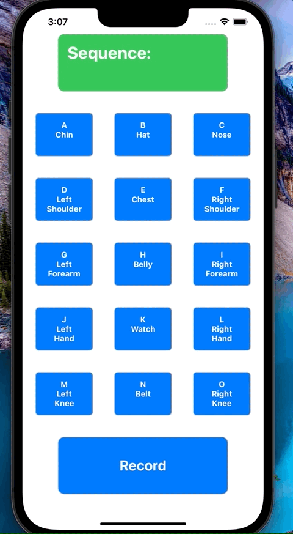

# Sign-Cracker

Developer:
**Corey Edh**

Why did I create this?
I created this app to try out SwiftUI for my Artifical Inteligence class, 
this is my first SwiftUI app. The inspiration behind a baseball sign 
cracking app comes from Mark Rober and his [Sign Stealing app](https://www.youtube.com/watch?v=PmlRbfSavbI) 
however I written this with algorithm that guess the signs bases on how 
many time certain signs were used.

Required Hardware:
* [x] iOS Device
* [x] MacOS Device

Required Software:
* [x] XCode
* [x] SwiftUI

What is in the app:
* Signs Given Page
* Result Page

## How to download the App and use it
* First copy the Git Repo Link
* Select Clone an existing project on launch screen of Xcode, and paste 
the Git Repo link into to the field.
* Run the Code

##App In Use

